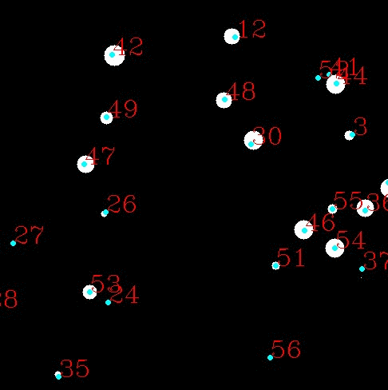

Track multiple object use kalman filter, reimplement by python.
learned from this website:
https://www.mathworks.com/help/vision/examples/motion-based-multiple-object-tracking.html
##
Framework for Multi Objects Tracking.

## Video demo
Generate video 
`cd CircleTrack`
`python partical`
Video demo
`python video_demo.py`
### Results

## Simulate 
`cd CircleTrack`
`python track`
### Results

# Waiting for implement......
## Evaluate Algrithm
Generate the prediction every frame, and calculate 
MOT tracking metrics.

