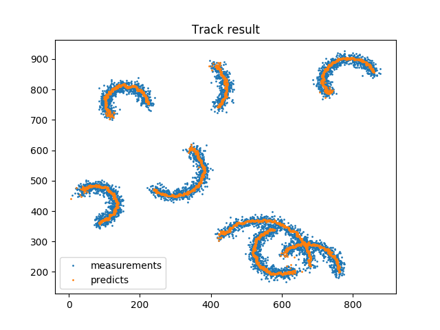

Track multiple object use kalman filter, reimplement by python.
learned from this website:
https://www.mathworks.com/help/vision/examples/motion-based-multiple-object-tracking.html
##
Framework for Multi Objects Tracking.

## modified log
* 2018.07.26
    
    Vectorize the distance cost function implementation.


## Video demo
Generate video 
```
cd CircleTrack
python partical
```
Video demo
```
python video_demo.py
```
### Results


I generated the results use big duration for seeing the results clearly.

## Simulate 
```
cd CircleTrack
python track.py
```
### Results


# Waiting for implement......
## Implement by C++
## Evaluate Algrithm
Generate the prediction every frame, and calculate 
MOT tracking metrics.

